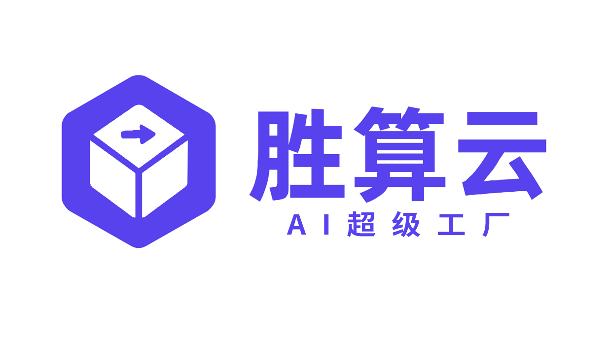
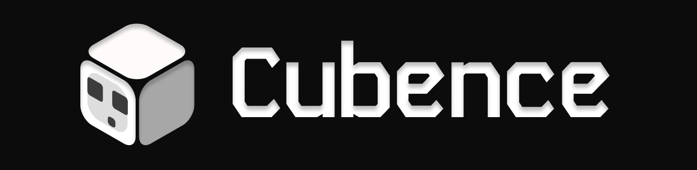
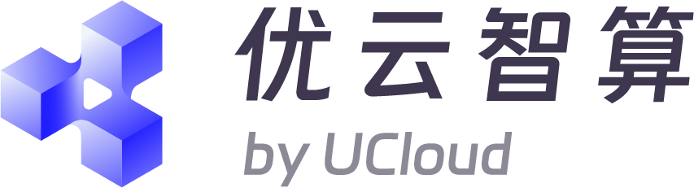
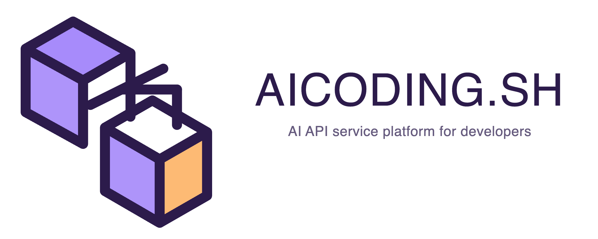
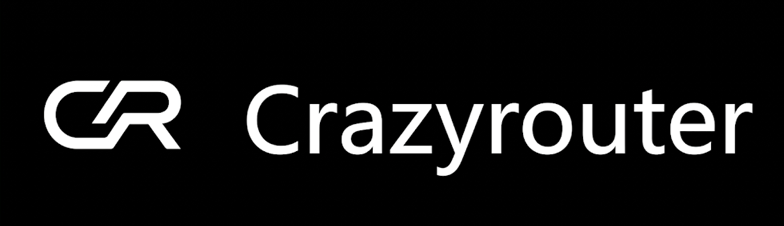
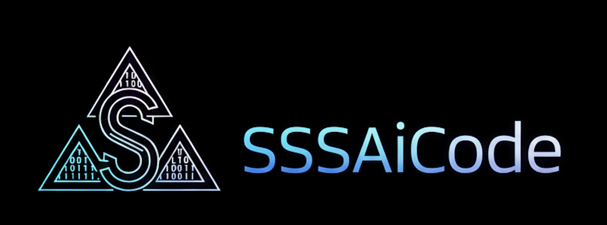
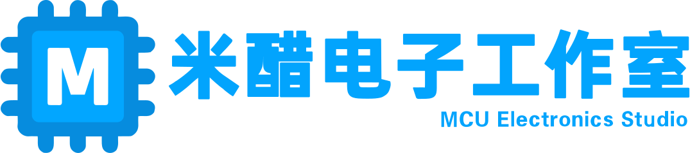
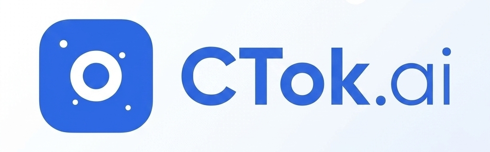
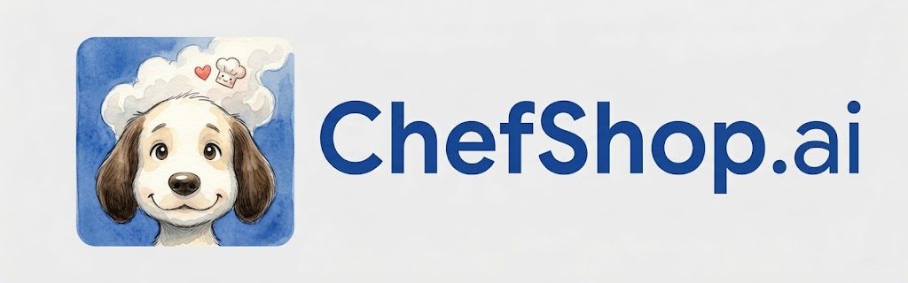
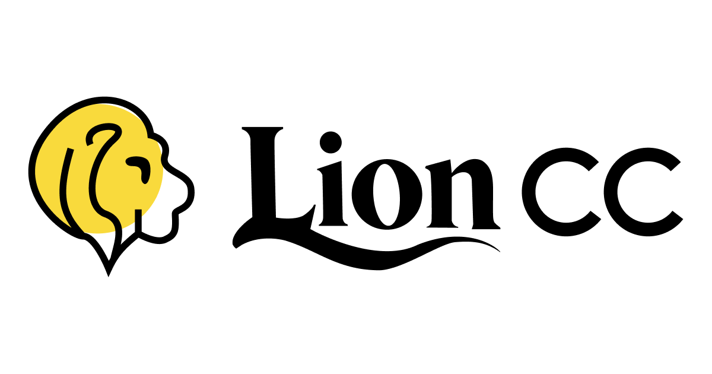

# CC Switch

### The All-in-One Manager for Claude Code, Codex, Gemini CLI, OpenCode, OpenClaw & Hermes Agent

English | [中文](README_ZH.md) | [日本語](README_JA.md) | [Changelog](CHANGELOG.md) | [Docs](docs/user-manual/en/README.md)

---

## v3.14.1 — What's New

### Claude Code Slash Commands Guide

Browse all **34 Claude Code `/` commands** in a searchable, categorized reference dialog. Each command shows its description, usage syntax, and whether it's session-only or has a CLI equivalent flag. One-click copy for quick terminal input.

> **Location**: Settings → About → "Claude Code Slash Commands" button

### Skills Ecosystem — One-Click Install

| Skill | Description |
|-------|-------------|
| **Skills CLI** | Universal agent skill package manager (`npx skills`). Install once, then use `skills add <repo>` to discover and install skills across 50+ coding agents (Claude Code, Codex, Cursor, etc.) |
| **Anthropic Skills** | 17 production-ready reference skills from Anthropic — document tools (docx, pdf, pptx, xlsx), creative design, MCP builder, webapp testing, and more. Auto-cloned into `~/.claude/skills/` for Claude Code discovery |

> **Location**: Settings → About — both available as one-click install cards with progress tracking

### Tool Uninstall & Update

Every tool and skill in the About page now has **Uninstall** and **Update** buttons alongside Install. When a newer version is detected, an update button appears with the target version. Uninstall includes a confirmation prompt.

Supports all 8 tools/skills:
- Claude Code, Codex, Gemini CLI, OpenCode, OpenClaw, Hermes Agent
- Skills CLI, Anthropic Skills

### Fixes

- **CommandsGuide dialog**: Added X close button; fixed z-index so the guide renders above the Settings dialog
- **Anthropic Skills install**: Fixed git clone path quoting on Windows
- **OpenClaw & Hermes Agent**: Fixed version detection (now included in `VALID_TOOLS`)

---

## Quick Links

- **[Full Feature List](docs/user-manual/en/README.md)** — Provider management, MCP, Prompts, Skills, Sessions, Proxy, Cloud Sync
- **[Download](https://github.com/farion1231/cc-switch/releases/latest)** — Windows MSI, macOS DMG, Linux deb/rpm/AppImage
- **[Changelog](CHANGELOG.md)** — Complete release history
- **[Screenshots](docs/user-manual/en/README.md#screenshots)**

## Download

| Platform | Package |
|----------|---------|
| **Windows** | `CC-Switch-v{version}-Windows.msi` or Portable `.zip` |
| **macOS** | `brew install --cask cc-switch` or `.dmg` |
| **Linux** | `.deb` / `.rpm` / `.AppImage` or `paru -S cc-switch-bin` (Arch) |

See [Releases](../../releases) for the latest version.

---

<strong>Sponsors</strong>

MiniMax-M2.7 is a next-generation large language model designed for autonomous evolution and real-world productivity. [Click here](https://platform.minimax.io/subscribe/coding-plan?code=ClLhgxr2je&source=link) for 12% off the MiniMax Token Plan.

---

<table>
<tr>
<td width="180"></td>
<td>Thanks to PackyCode for sponsoring this project! PackyCode provides relay services for Claude Code, Codex, Gemini. <a href="https://www.packyapi.com/register?aff=cc-switch">Register here</a> and use promo code "cc-switch" for 10% off first recharge.</td>
</tr>
<tr>
<td width="180"></td>
<td>AIGoCode integrates Claude Code, Codex, and Gemini models — stable, efficient AI coding services. <a href="https://aigocode.com/invite/CC-SWITCH">Register here</a> for 10% bonus on first top-up.</td>
</tr>
<tr>
<td width="180"></td>
<td>Shengsuanyun — industrial-grade AI task platform. <a href="https://www.shengsuanyun.com/?from=CH_4HHXMRYF">Register here</a> for ¥10 credits + 10% bonus on first top-up.</td>
</tr>
<tr>
<td width="180"></td>
<td>AICodeMirror — official high-stability relay for Claude Code / Codex / Gemini CLI. <a href="https://www.aicodemirror.com/register?invitecode=9915W3">Register here</a> for 20% off first top-up.</td>
</tr>
<tr>
<td width="180"></td>
<td>PatewayAI — API relay built for heavy AI developers. <a href="https://pateway.ai/?ch=etzpm8&aff=WB6M6F67#/">Register here</a> for $3 trial credit.</td>
</tr>
<tr>
<td width="180"></td>
<td>SiliconFlow — high-performance AI infrastructure and model API platform. <a href="https://cloud.siliconflow.cn/i/drGuwc9k">Register here</a> for ¥16 bonus credit.</td>
</tr>
<tr>
<td width="180"></td>
<td>Cubence — reliable API relay for Claude Code, Codex, Gemini. <a href="https://cubence.com/signup?code=CCSWITCH&source=ccs">Register here</a> with code "CCSWITCH" for 10% off.</td>
</tr>
<tr>
<td width="180"></td>
<td>DMXAPI — global large model API services for 200+ enterprise users. <a href="https://www.dmxapi.cn/register?aff=bUHu">Register here</a>.</td>
</tr>
<tr>
<td width="180"></td>
<td>Compshare — UCloud's AI cloud platform. <a href="https://www.compshare.cn/coding-plan?ytag=GPU_YY_YX_git_cc-switch">Register here</a> for ¥5 trial credit.</td>
</tr>
<tr>
<td width="180"></td>
<td>AICoding.sh — global AI model API relay. <a href="https://aicoding.sh/i/CCSWITCH">Register here</a> for 10% off first top-up.</td>
</tr>
<tr>
<td width="180"></td>
<td>Crazyrouter — high-performance AI API aggregation. <a href="https://crazyrouter.com/register?aff=OZcm&ref=cc-switch">Register here</a> for $2 credit + 30% bonus.</td>
</tr>
<tr>
<td width="180"></td>
<td>Right Code — reliable routing for Claude Code, Codex, Gemini. <a href="https://www.right.codes/register?aff=CCSWITCH">Register here</a> for 25% bonus on top-ups.</td>
</tr>
<tr>
<td width="180"></td>
<td>SSSAiCode — stable, affordable Claude and Codex model services. <a href="https://www.sssaicode.com/register?ref=DCP0SM">Register here</a> for $10 extra credit per top-up.</td>
</tr>
<tr>
<td width="180"></td>
<td>Micu API — global LLM relay with best cost-performance ratio. <a href="https://www.openclaudecode.cn/register?aff=aOYQ">Register here</a> with code "ccswitch" for 10% discount.</td>
</tr>
<tr>
<td width="180"></td>
<td>LemonData — 300+ models, 30–70% below official rates. <a href="https://lemondata.cc/r/FFX1ZDUP">Register here</a> for $1 free credit.</td>
</tr>
<tr>
<td width="180"></td>
<td>CTok.ai — one-stop AI programming tool service platform. <a href="https://ctok.ai">Register here</a>.</td>
</tr>
<tr>
<td width="180"></td>
<td>ChefShop AI — premium account services for AI subscriptions. <a href="https://chefshop.ai">Visit here</a>.</td>
</tr>
<tr>
<td width="180"></td>
<td>LionCC — Claude Code, Codex, OpenClaw computing services. <a href="https://vibecodingapi.ai">Register here</a> with code "cc-switch" for $10 credits.</td>
</tr>
<tr>
<td width="180"></td>
<td>DDS Hub — cost-effective Claude API proxy. <a href="https://ddshub.short.gy/ccswitch">Register here</a> for 10% extra on first recharge.</td>
</tr>
</table>

## License

MIT © Jason Young
